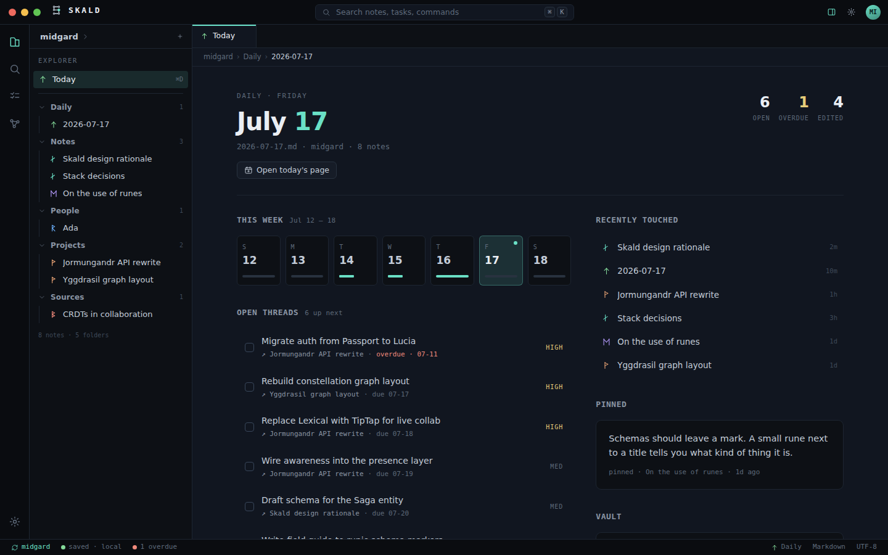
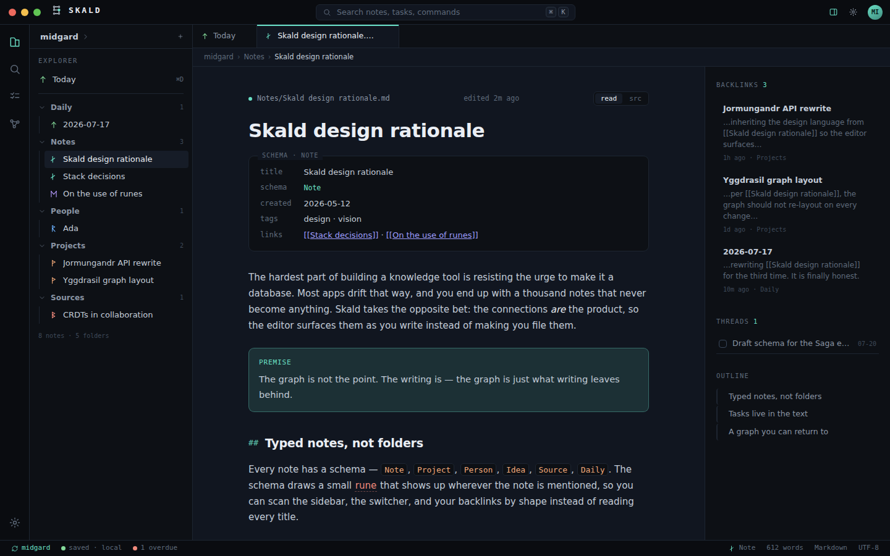
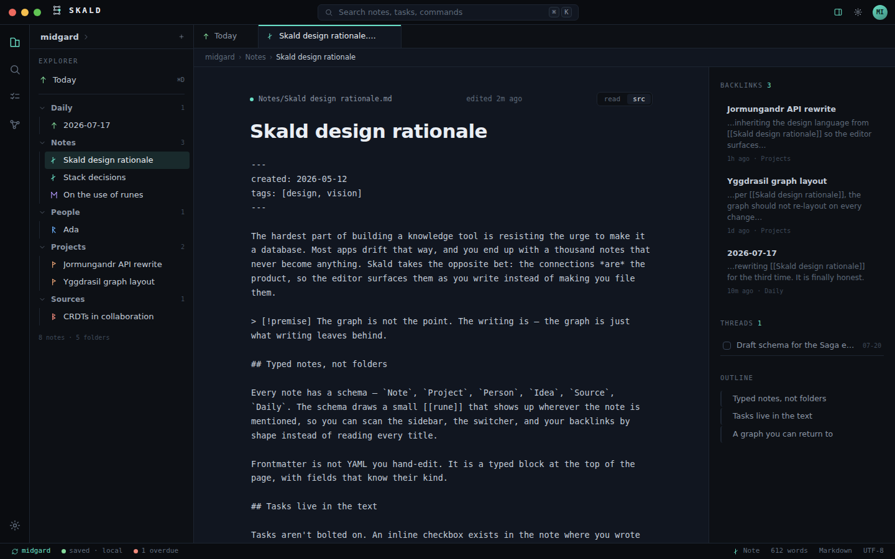
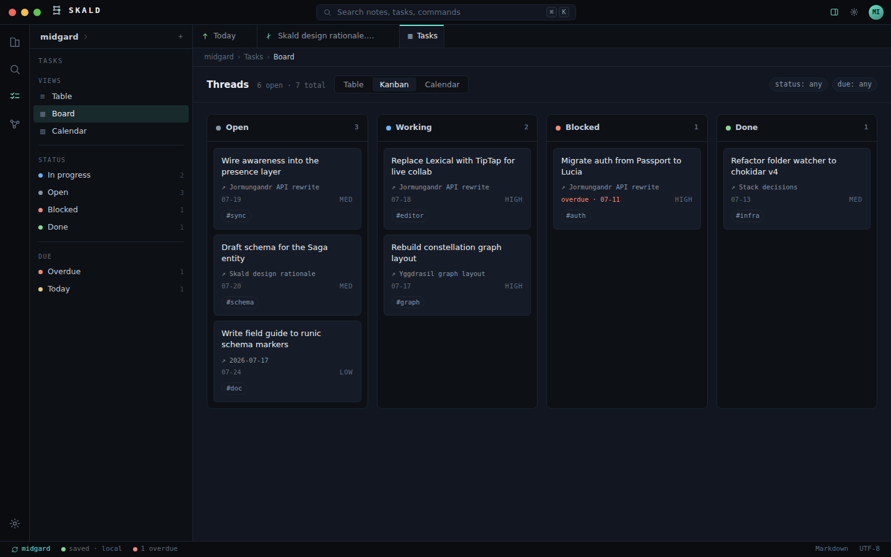
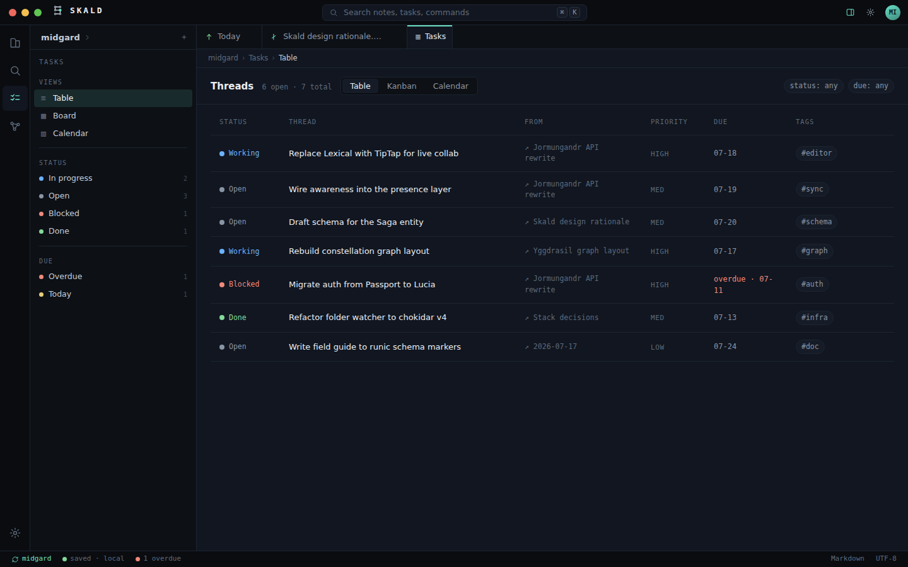
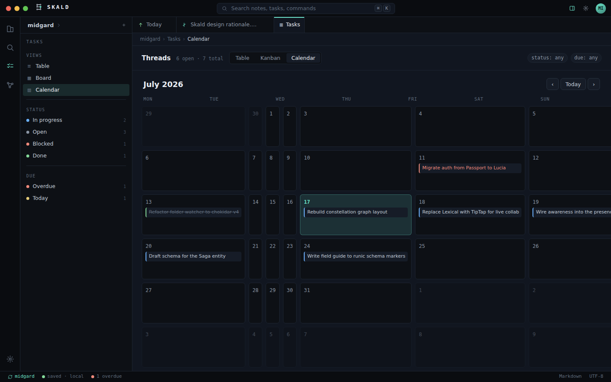
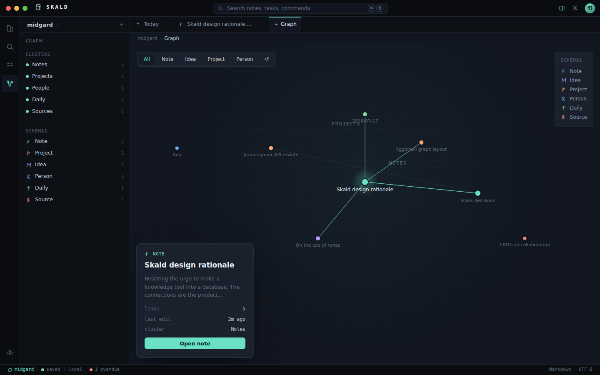
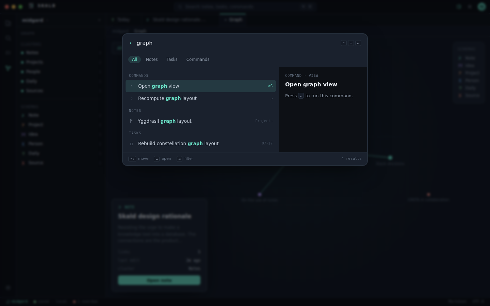
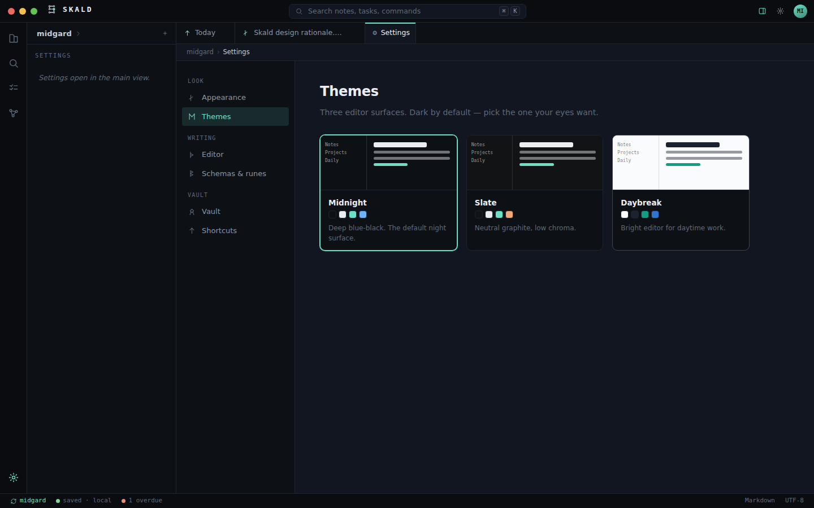

# Skald

Skald is a local-first Markdown knowledge base. A *skáld* was an Old Norse poet — the one
who kept the saga alive. Skald treats your vault the same way: notes are pages of a saga,
tasks are open threads, and the knowledge graph is a constellation you can return to.

Everything is plain Markdown files in a folder you own. Skald keeps its index, settings,
graph layout, and local note history in a `.skald/` directory inside the vault — delete
it and your Markdown remains untouched.



## What it does

- **Typed notes** — every note has a schema (`Note`, `Project`, `Person`, `Daily`, `Idea`,
  `Source`, `Code`, `Place`), set via frontmatter or inferred from its folder. Each schema
  carries a monoline rune that follows the note everywhere it's mentioned.
- **Threads** — any `- [ ]` checkbox you write becomes a task in the global Table, Kanban,
  and Calendar views. Edits propagate both ways: check it in the board and the Markdown
  file is rewritten; metadata rides along as `@due(2026-06-01) @p(high) @status(working) #tag`.
- **Wikilinks & backlinks** — `[[Note]]` links resolve across the vault; the editor's
  right panel shows backlinks with snippets, threads in the note, and the outline.
  Renaming a note rewrites every wikilink that points at it.
- **The Logbook** — the Today view: week activity, open threads, the saga (recent
  activity), recently touched notes, a pinned note, and honest vault stats.
- **The Constellation** — a stable graph. Star positions are laid out once, persisted, and
  draggable; folders appear as named clusters. Your map is a place, not a simulation.
- **Local note history** — Skald snapshots notes before edits, external changes, renames,
  deletions, and restores. Earlier versions can be previewed and restored from the editor.
- **First-class attachments** — pick or drop any file, paste clipboard images, and Skald
  copies them into the vault with collision-safe names and portable relative Markdown links.
  Images render inline; files can be opened or revealed from the editor.
- **Live Markdown editing** — write in rendered blocks by default, with raw source mode still
  one shortcut away when you want to work directly with the Markdown file.
- **Skald's Hall** — `⌘K` fuzzy search across notes, tasks, and commands with a live
  preview pane.
- **Three surfaces** — Midnight, Slate, and Daybreak themes; three densities; three marks.

## Screenshots

| | |
| --- | --- |
|  *Editor — reading view, typed frontmatter, backlinks margin* |  *Editor — source view with autosave* |
|  *Threads — kanban, drag to change status* |  *Threads — table* |
|  *Threads — calendar* |  *The Constellation — stable, draggable star map* |
|  *Skald's Hall — ⌘K fuzzy search with preview* |  *Settings — the Daybreak surface* |

## Development

```bash
npm install
npm run electron:dev   # dev server + electron
npm run typecheck
npm test               # vitest — core logic + vault end-to-end
npm run electron:pack  # build distributables
```

Repo layout:

- `src-main/` — Electron main process: vault manager (scan, watch, index, tasks,
  backlinks, graph layout), IPC, window.
- `src/` — renderer: React + plain CSS design tokens (no CSS framework).
- `src-shared/` — pure logic shared by both: frontmatter, tasks, wikilinks, fuzzy search.
- `tests/` — vitest suites, including an end-to-end suite driving a real temp vault.
- `archive/skald-v1/` — the previous implementation, kept for reference only.

## Keyboard

| Key | Action |
| --- | --- |
| `⌘K` / `⌘P` | Command palette |
| `⌘D` | Today's logbook |
| `⌘N` | New note |
| `⌘E` | Toggle reading / source view |
| `⌘B` | Toggle right panel |
| `⌘G` | Constellation |
| `⌘S` | Save now (autosave is always on) |

## License

MIT © Christoffer Madsen
